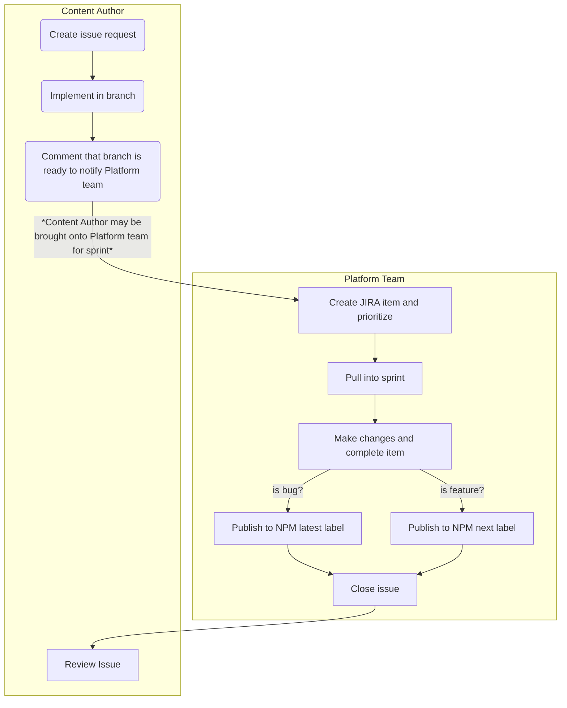

## Contributing  

Have a new component that you think will be usable or encountered a bug and would like to fix it yourself?  
We encourage contributions to the UI Component Library, but, in order to maintain organization and ensure quality components we have some processes and guidelines to be followed.

### The Process

Here is an overview of our contribution process.  Written instructions for bugs and features can be found linked below.

### Bug Fixes

[Contributing bug fixes](.gitlab/contribution_guidelines/contributing_bugfix.md)

### Features

[Contributing features](.gitlab/contribution_guidelines/contributing_feature.md)
