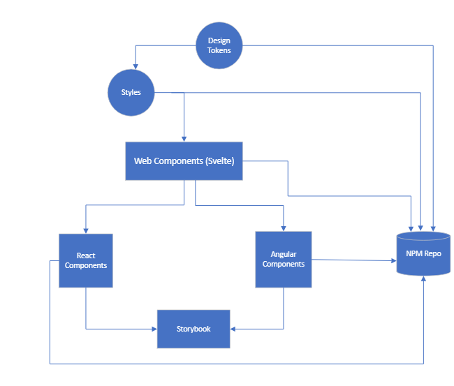

import { Meta } from "@storybook/addon-docs";

<Meta title={`Architecture`} />

# Design system technologies

The DDD Design System is built with Web Components. Web Components are technology agnostic. You can choose various front-end frameworks, like Angular, React, or Vue, to use with our web components. All components include sample HTML and only use JavaScript when necessary.

## [Web components](https://developer.mozilla.org/en-US/docs/Web/Web_Components)

Web Components is a suite of different technologies allowing you to create reusable custom elements with styling and functionality encapsulated away from the rest of your code.

### Benefits of using web components

- **Reuse**: A component is made once and can be reused across different pages, apps, or frameworks.

- **Support**: Once fully standardized, it will work on any browser without additional libraries.

- **Maintenance**: Since the design is modular and the components are self-contained, they're easier to maintain.

- **Encapsulation**: Markup structure, style, and behaviour will be kept hidden and separate from other code on the page so that different parts do not clash

- **Reliability**: Code is not spread across HTML and JS files, thereby avoiding inconsistencies.

- **Flexibility**: Components can be written inline, imported or even compiled.

- **Composability**: Components can use or interface with other components.

### Using web components in your project

Web Components generated from Svelte can be used inside various other front-end frameworks or used with our Angular or React implementations.

## [Svelte](https://svelte.dev/)

Svelte
Svelte is a JavaScript framework that we are using to generate web components.

### Why we use Svelte

We use Svelte to build our web components. Svelte gathers the logic (JavaScript), the structure (HTML), and the style (CSS) in the same file. Then, Svelte is used to build single and reusable components for larger applications written with various front-end frameworks.

## [Angular](https://angular.io/)

Angular is a TypeScript-based open-source platform and web application framework that helps us to create single-page applications using TypeScript and HTML. It uses HTML to define the UI of the application. It is a declarative and intuitive language with directives like ng-app, ng-model, ng-repeat, and forms control.

Angular is the most used web application framework in this organization.

### How Web Components and Angular work together

Our Angular implementation adds form binding, both Reactive and Template, to our web components.

Angular applications will need to use our web components and Angular components.

## [React](https://reactjs.org/)

React is an open-source JavaScript library commonly used to create user interfaces for single-page applications from isolated components.

React is the 2nd most used web application framework in this organization.

### How Web Components and React work together

We use React to create wrappers around our web components. This helps manage events and properties of the web components rather than trying to use our web components by themselves.

The React wrappers are used inside a React app, which then makes requests back to our web components to create the actual component.

## [Storybook](https://storybook.js.org/)

Storybook is a front-end workshop for building UI components and pages in isolation.

### Benefits of using Storybook

- To easily showcase our components via “stories.”

- Component properties are documented alongside Angular and React code snippets.

- To show documentation of our Design System.
