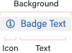
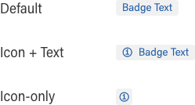
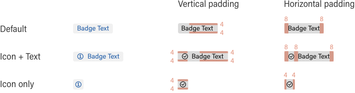
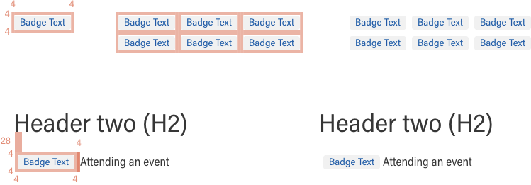
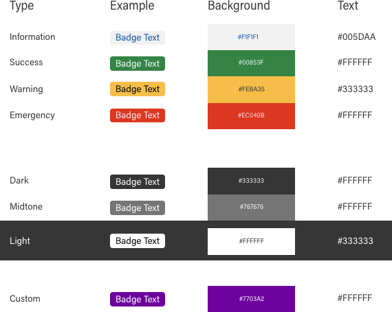
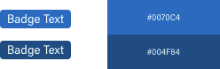

import {
  Meta,
  Canvas,
  Story,
} from '@storybook/addon-docs';

import { action } from '@storybook/addon-actions';
import { Tabs, Tab, Note } from '@abgov/shared/storybook-common';

<Meta title="Components/Badge" />

# Badge

Badges are system driven, non-interactive, small labels
which display minimal amounts of information, system feedback, or states.

[Figma design component](https://www.figma.com/file/qWGWDvULAAZuVaDpXCRzqP/DS-Website?node-id=820%3A11807)

## Component Preview

Badge with icon and text

<goa-badge type="information" content="Information" icon />
&nbsp;
<goa-badge type="success" content="Success" icon />
&nbsp;
<goa-badge type="warning" content="Warning" icon />
&nbsp;
<goa-badge type="emergency" content="Emergency" icon />
&nbsp;
<goa-badge type="dark" content="Dark" icon />
&nbsp;
<goa-badge type="midtone" content="Midtone" icon />
&nbsp;
<goa-badge type="light" content="Light" icon />
&nbsp;

Badge with text only

<goa-badge type="information" content="Information" />
&nbsp;
<goa-badge type="success" content="Success" />
&nbsp;
<goa-badge type="warning" content="Warning" />
&nbsp;
<goa-badge type="emergency" content="Emergency" />
&nbsp;
<goa-badge type="dark" content="Dark" />
&nbsp;
<goa-badge type="midtone" content="Midtone" />
&nbsp;
<goa-badge type="light" content="Light" />

Badge with icon only

<goa-badge type="information" icon />
&nbsp;
<goa-badge type="success" icon />
&nbsp;
<goa-badge type="warning" icon />
&nbsp;
<goa-badge type="emergency" icon />
&nbsp;
<goa-badge type="dark" icon />
&nbsp;
<goa-badge type="midtone" icon />
&nbsp;
<goa-badge type="light" icon />

<Tabs>
  <Tab label="Web Component">
    <pre>
      { `<goa-badge type="warning" content="Warning" icon />` }
    </pre>
    <pre>
      { `<goa-badge type="warning" content="Warning" />` }
    </pre>
    <pre>
      { `<goa-badge type="warning" icon />` }
    </pre>
  </Tab>
  <Tab label="Angular">
    <pre>
      { `<goa-badge type="warning" content="Warning" icon />` }
    </pre>
    <pre>
      { `<goa-badge type="warning" content="Warning" />` }
    </pre>
    <pre>
      { `<goa-badge type="warning" icon />` }
    </pre>
  </Tab>
  <Tab label="React">
    <pre>
      { `<GoABadge type="warning" content="Warning" icon />` }
    </pre>
    <pre>
      { `<GoABadge type="warning" content="Warning" />` }
    </pre>
    <pre>
      { `<GoABadge type="warning" icon />` }
    </pre>
  </Tab>
</Tabs>

## Layouts and variants

In order to provide flexibility and accommodate special use-cases, the icon before the text is optional.

<Note type="best-practices">
  Icons are optional and limited to the <strong>Essential Icons</strong> (as indicated in Iconography) -- <i>Alert and Message Navigation and User Interface</i>
</Note>

The default badge surface is text without icon.
There are also an icon + text and icon-only badge.

The icons used should be supplemental and enhance the semantic meaning of the badge, used sparingly, and only with semantic colours (as defined below).

<Note type="caution">
The Icon-only badge is limited to only:
<ul>
  <li>mobile implementations;</li>
  <li>if space is at a permium and a full badge would be detrimental to the layout; and,</li>
  <li>if the semantic meaning of the icon is sufficiently clear without the text.</li>
</ul>
</Note>

## Sizing, Padding and Margins

### Text and Icon Sizing

The text in the badge has the “Captions” properties (Weight: Regular, Size: 14, Line-height: 24) and the icon is 14px × 14px.

<goa-badge type="information" content="Information" icon />

#### Internal padding

The internal padding of the badge is generally 4px for vertical padding and 8px for horizontal padding. However, due to better visual layout, the vertical spacing for the text is different, as outlined below.

#### External margins

The margins of the badge are minimum 4px all-round. In groups of other badges, this results 8px between neighbouring badges, both vertically and horizontally.

With other non-badge elements, this margin is a minimum of 8px.

## Colours

#### Semantic Colours

Badge colours used are in-line with already defined colours in the design system.

The “Information” badge uses blue text on a grey ground.

#### Custom Colours

Recognizing and understanding there may be instances or scenarios where a unique colour is necessary, there is a certain amount of flexibility afforded to the badges. Ensure that the colours are in accordance with WCAG 2.0 standards, and maintain a contrast ratio of 4.5 or higher for all text sizes.

<Note type="caution">
  Custom colors should be used sparingly.

  There should be a very unique use-case or specific reason for this, and the colours should align to the Government of Alberta and Alberta.ca branding guidelines as closely as possible.
</Note>

#### The following general rules apply:

1. Dark-coloured backgrounds are accessible with white text.
2. Midtone and light-coloured backgrounds are accessible with dark text.

<Note type="dont">
  Don't use <strong>Interactive colours</strong> as these colours are reserved for links, buttons, and other interactive elements. Badges are inherently used for information and organization, not interactivity.
   
   
  
</Note>

---

## Support

<goa-callout type="information" title="Need help? Connect with us on Slack">
  <a href="https://goa-dio.slack.com/archives/C02PLLT9HQ9">#design-system-support</a> General information and discussion related to design system including questions, new component proposals, contribution, and other requests.
</goa-callout>

### Help improve this page

To help make sure that this page is useful, relevant, and up to date, you can:

[Create an issue for a proposed update or contribution](https://github.com/GovAlta/ui-components/issues/new/choose)
