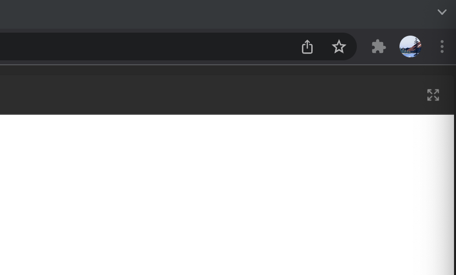

import {
  Meta,
  Canvas,
  Story,
} from '@storybook/addon-docs';

import { action } from '@storybook/addon-actions';

<Meta title="Components/Badge" />

# Badge

<goa-badge type="warning" content="Warning" icon />

# Test

