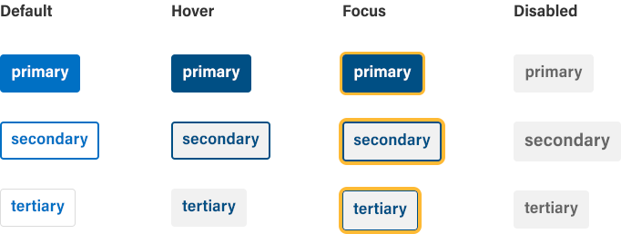
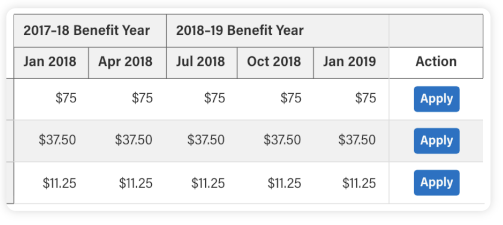

import { Meta } from '@storybook/addon-docs';
import { Tabs, Tab, Note, Block } from '@abgov/shared/storybook-common';

<Meta title="Components/Button" />

### Component

# Button

Buttons allow users to perform an action or to navigate to another page. They have multiple styles for various needs, and are ideal for calling attention to where a user needs to do something or so they can move forward in a flow.

[Figma design component](https://www.figma.com/file/qWGWDvULAAZuVaDpXCRzqP/DS-Website?node-id=916%3A11660)

---

## Component preview

<Block>

  Primary button

  <goa-button type="primary">Primary</goa-button>

  Secondary button

  <goa-button type="secondary">Secondary</goa-button>

  Tertiary button

  <goa-button type="tertiary">Tertiary</goa-button>

</Block>

<Tabs>
  <Tab label="Web Component">
    <pre>
      { `<goa-button type="primary">Primary</goa-button>` }
    </pre>
    <pre>
      { `<goa-button type="secondary">Secondary</goa-button>` }
    </pre>
    <pre>
      { `<goa-button type="tertiary">Tertiary</goa-button>` }
    </pre>
  </Tab>
  <Tab label="Angular">
    <pre>
      { `<goa-button type="primary">Primary</goa-button>` }
    </pre>
    <pre>
      { `<goa-button type="secondary">Secondary</goa-button>` }
    </pre>
    <pre>
      { `<goa-button type="tertiary">Tertiary</goa-button>` }
    </pre>
  </Tab>
  <Tab label="React">
    <pre>
      { `<GoAButton type="primary">Primary</GoAButton>` }
    </pre>
    <pre>
      { `<GoAButton type="secondary">Secondary</GoAButton>` }
    </pre>
    <pre>
      { `<GoAButton type="tertiary">Tertiary</GoAButton>` }
    </pre>
  </Tab>
</Tabs>

## Types

There are three main button types: Primary, Secondary, and Tertiary. If there is only one button on a page, it should be a primary button. There should only ever be one primary button on a page

<goa-button-group>
  <goa-button type="primary">Primary</goa-button>
  <goa-button type="secondary">Secondary</goa-button>
  <goa-button type="tertiary">Tertiary</goa-button>
</goa-button-group>

<Note type="do">
  

    Use the primary buttons for main actions and secondary buttons for less important action.
  

  <goa-button-group>
    <goa-button type="primary">Save</goa-button>
    <goa-button type="tertiary">Cancel</goa-button>
  </goa-button-group>
</Note>

<Note type="dont">
  
Use two primary buttons

  <goa-button-group>
    <goa-button type="primary">Save</goa-button>
    <goa-button type="primary">Cancel</goa-button>
  </goa-button-group>
</Note>

---

## States

There are four interactive states for a button: default, hover, focus, and disabled.

---

## Sizes

There are three main button sizes: Medium, Small, and Large.

#### Medium button (default)

<goa-button-group>
  <goa-button type="primary">Primary</goa-button>
  <goa-button type="secondary">Secondary</goa-button>
  <goa-button type="tertiary">Tertiary</goa-button>
</goa-button-group>

“Medium” buttons should be used unless specific use cases require additional sizing.

#### Small button

<goa-button-group gap="small">
  <goa-button type="primary" size="small">Small primary</goa-button>
  <goa-button type="secondary" size="small">Small secondary</goa-button>
  <goa-button type="tertiary" size="small">Small tertiary</goa-button>
</goa-button-group>

“Small” buttons can be inside of a table where information is dense and space is at a premium.

#### Large button

<goa-button-group>
  <goa-button type="primary" size="large">Large primary</goa-button>
  <goa-button type="secondary" size="large">Large secondary</goa-button>
  <goa-button type="tertiary" size="large">Large tertiary</goa-button>
</goa-button-group>

“Large” buttons should be used sparingly to create emphasis around a primary call to action.

<Note type="do">
  

    Use the small button size to save space in compact scenarios
  

  
</Note>

<Note type="dont">
  

    Don't use different button sized in the same area as a way to emphasize hierarchy
  

  <goa-button-group>
    <goa-button type="tertiary" size="small">Back</goa-button>
    <goa-button type="primary" size="large">Next</goa-button>
  </goa-button-group>
</Note>

---

## Support

<goa-callout type="information" title="Need help? Connect with us on Slack">
  <a href="https://goa-dio.slack.com/archives/C02PLLT9HQ9">#design-system-support</a> General information and discussion
  related to design system including questions, new component proposals, contribution, and other requests.
</goa-callout>

### Help improve this page

To help make sure that this page is useful, relevant, and up to date, you can:

[Create an issue for a proposed update or contribution](https://github.com/GovAlta/ui-components/issues/new/choose)
