import {
  Meta,
  Canvas,
  Story,
} from '@storybook/addon-docs';

import { action } from '@storybook/addon-actions';
import { Tabs, Tab, Note } from '@abgov/shared/storybook-common';

<Meta title="Components/Checkbox" />

### Component

# Checkbox

Checkboxes are contained in a fieldset for accessibility and categorization purposes.
The option group (checkbox and label) can be selected by the user with an input device.
The option is meant to be submitted as data and is part of a form.
The input data, while can be selected, will not be recorded until the user presses a submission button.

[Figma design component](https://www.figma.com/file/3pb2IK8s2QUqWieH79KdN7/Components---DIO-DS?node-id=458%3A16984)

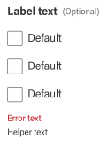

## States

Checkboxes can be checked, unchecked, or indeterminate.
They have default, focus, hover, disabled and error states.

When a checkbox isn’t checked nor it is checked. It’s Indeterminate.
It’s that in-between state that we might consider a “Mix” between “Selected” and “Unselected” options.

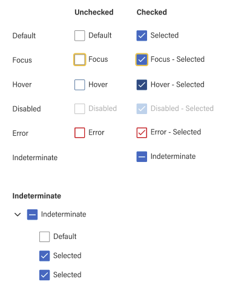

## Spacing & Padding

Ensure there is 8px padding between checkbox and label.

<Note type="do">
  
 Maintain correct spacing with the component 

  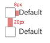
</Note>

<Note type="dont">
  
 Change spacing and padding values 

  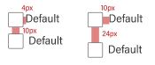
</Note>

The padding between checkboxes is enough for any touch input device.

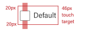

## Usage

Use checkboxes when the user can select more than one option.

The fieldset width is responsive to 100% of the layout container while the arrangement is set vertically for ease of scanning and comparing.
The fieldset title should be clear, concise, and relevant to the group of options.

Add ‘Optional’ only to questions which can be left unanswered.
Start all checkboxes with a capital letter.
Don’t include punctuations after checkbox label.

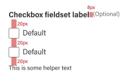

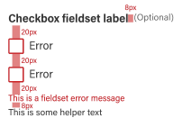

<Note type="do">
  
 Use checkboxes when the user is allowed to select more than one option. 

</Note>

<Note type="dont">
  
 Require the user to make a selection. Checkboxes should be optional input. 

</Note>

<Note type="do">
  
 List your options vertically 

  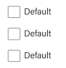
</Note>

<Note type="dont">
  
 List your options horizontally 

  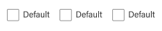
</Note>

<Note type="do">
  
 Checkbox should always be left to the label 

  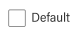
</Note>

<Note type="dont">
  
 Move the checkbox to the right on the label 

  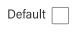
</Note>

---

## Support

<goa-callout type="information" title="Need help? Connect with us on Slack">
  <a href="https://goa-dio.slack.com/archives/C02PLLT9HQ9">#design-system-support</a> General information and discussion related to design system including questions, new component proposals, contribution, and other requests.
</goa-callout>

### Help improve this page

To help make sure that this page is useful, relevant, and up to date, you can:

[Create an issue for a proposed update or contribution](https://github.com/GovAlta/ui-components/issues/new/choose)
