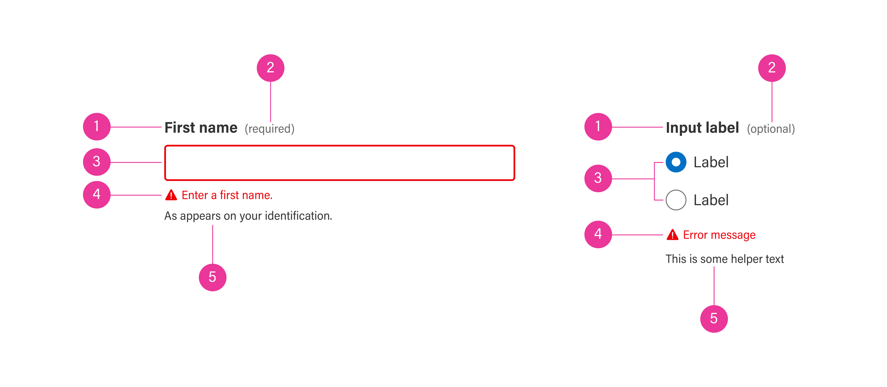

import { Meta, Story } from "@storybook/addon-docs";
import {
  Tabs,
  Tab,
  CodeSnippet,
  SupportInfo,
  Props,
  Prop,
} from "@abgov/shared/storybook-common";
import {
  GoAFormItem,
  GoAInput,
  GoADropdown,
  GoADropdownItem,
  GoAButtonGroup,
  GoAButton,
  GoARadioGroup,
  GoARadioItem,
  GoACheckbox,
} from "@abgov/react-components";

<Meta title="Utility/Form Item" />

# Form item

### A form item wraps an input control such as a text input, checkbox, or radio with a text label, requirement label, helper text, and error text.

---

## Properties

<Props showTabs={true}>
  <Prop
    name="label"
    type="string"
    description="Creates a label for a form item"
  />
  <Prop
    name="helptext"
    lang="angular"
    type="string"
    description="Help text displayed under the form field to provide an additional explanation"
  />
  <Prop
    name="helpText"
    lang="react"
    type="string"
    description="Help text displayed under the form field to provide an additional explanation"
  />
  <Prop
    name="error"
    type="string"
    description="Error text displayed under the form field. Leave blank to indicate valid field."
  />
  <Prop
    name="requirement"
    type="optional | required"
    description="Marks the field with optional/required label."
  />
  <Prop
    name="id"
    lang="react"
    type="string"
    description="The id of the label, necessary for field's aria-labelledby attribute for the screen reader."
  />
</Props>

  
Additional Properties

  <Props showTabs={true}>
    <Prop
      name="mt"
      type="none | 3xs | 2xs | xs | s | m | l | xl | 2xl | 3xl | 4xl"
      defaultValue="none"
      description="Top margin"
    />
    <Prop
      name="mr"
      type="none | 3xs | 2xs | xs | s | m | l | xl | 2xl | 3xl | 4xl"
      defaultValue="none"
      description="Right margin"
    />
    <Prop
      name="mb"
      type="none | 3xs | 2xs | xs | s | m | l | xl | 2xl | 3xl | 4xl"
      defaultValue="none"
      description="Bottom margin"
    />
    <Prop
      name="ml"
      type="none | 3xs | 2xs | xs | s | m | l | xl | 2xl | 3xl | 4xl"
      defaultValue="none"
      description="Left margin"
    />
  </Props>

## Text label

<Story name="Text label">
  <GoAFormItem label="First name" id="firstName">
    <GoAInput name="firstName" ariaLabelledBy="firstName" />
  </GoAFormItem>
  

  <GoAFormItem label="Checkbox Colors">
    <GoACheckbox name="colors" text="Red" value="red"></GoACheckbox>
    <GoACheckbox name="colors" text="Blue" value="blue"></GoACheckbox>
  </GoAFormItem>
  

  <GoAFormItem label="Radio Colors">
    <GoARadioGroup name="colors">
      <GoARadioItem name="colors" label="Red" value="red" />
      <GoARadioItem name="colors" label="Blue" value="blue" />
    </GoARadioGroup>
  </GoAFormItem>
  

  <GoAFormItem label="Dropdown Colors" id="colorDropdown">
    <GoADropdown name="colors" ariaLabelledBy="colorDropdown">
      <GoADropdownItem name="colors" value="red" label="Red" />
      <GoADropdownItem name="colors" value="green" label="Green" />
    </GoADropdown>
  </GoAFormItem>
  

  <GoAFormItem label="Button label">
    <GoAButtonGroup alignment="start">
      <GoAButton type="primary">Next</GoAButton>
    </GoAButtonGroup>
  </GoAFormItem>
</Story>

<Tabs>
  <Tab label="Web Component" hidden={true}>
    <CodeSnippet
      lang="html"
      code={`
      <goa-form-item label="First name">
        <goa-input name="firstName" />
      </goa-form-item>
      <goa-form-item label="Checkbox Colors">
        <goa-checkbox name="colors" text="Red" value="red"></goa-checkbox>
        <goa-checkbox name="colors" text="Blue" value="blue"></goa-checkbox>
      </goa-form-item>
      <goa-form-item label="Radio Colors">
        <goa-radio-group name="colors">
            <goa-radio-item name="colors" label="Red" value="red" />
            <goa-radio-item name="colors" label="Blue" value="blue" />
        </goa-radio-group>
      </goa-form-item>
      <goa-form-item label="Dropdown Colors">
        <goa-dropdown name="colors">
          <goa-dropdown-item name="colors" value="red" label="Red" />
          <goa-dropdown-item name="colors" value="green" label="Green" />
        </goa-dropdown>
      </goa-form-item>
      <goa-form-item label="Button label">
          <goa-button type="primary">Next</goa-button>
      </goa-form-item>
    `}
    />
  </Tab>
  <Tab label="Angular">
    <CodeSnippet
      lang="html"
      code={`
      <goa-form-item label="First name" id="firstName">
        <goa-input name="firstName" arialabelledby="firstName"></goa-input>
      </goa-form-item>
      <goa-form-item label="Checkbox Colors">
        <goa-checkbox name="colors" text="Red" value="red"></goa-checkbox>
        <goa-checkbox name="colors" text="Blue" value="blue"></goa-checkbox>
      </goa-form-item>
      <goa-form-item label="Radio Colors">
        <goa-radio-group name="colors">
            <goa-radio-item name="colors" label="Red" value="red"></goa-radio-item>
            <goa-radio-item name="colors" label="Blue" value="blue"></goa-radio-item>
        </goa-radio-group>
      </goa-form-item>
      <goa-form-item label="Dropdown Colors" id="colorsDropdown">
        <goa-dropdown name="colors" arialabelledby="colorsDropdown">
          <goa-dropdown-item name="colors" value="red" label="Red"></goa-dropdown-item>
          <goa-dropdown-item name="colors" value="green" label="Green"></goa-dropdown-item>
        </goa-dropdown>
      </goa-form-item>
      <goa-form-item label="Button label">
          <goa-button type="primary">Next</goa-button>
      </goa-form-item>
    `}
    />
  </Tab>
  <Tab label="React">
    <CodeSnippet
      lang="tsx"
      code={`
          <GoAFormItem label="First name" id="firstName">
            <GoAInput name="firstName" ariaLabelledBy="firstName" value="" onChange={() => void 0}/>
          </GoAFormItem>
          <GoAFormItem label="Checkbox Colors">
            <GoACheckbox name="colors" text="Red" value="red" checked={false}></GoACheckbox>
            <GoACheckbox name="colors" text="Blue" value="blue" checked={false}></GoACheckbox>
          </GoAFormItem>
          <GoAFormItem label="Radio Colors">
            <GoARadioGroup name="colors" onChange={() => { }}>
                <GoARadioItem name="colors" label="Red" value="red" />
                <GoARadioItem name="colors" label="Blue" value="blue" />
            </GoARadioGroup>
          </GoAFormItem>
          <GoAFormItem label="Dropdown Colors" id="colorsDropdown">
            <GoADropdown name="colors" ariaLabelledBy="colorsDropdown" error={false} value="" onChange={() => { }}>
              <GoADropdownItem name="colors" value="red" label="Red" />
              <GoADropdownItem name="colors" value="green" label="Green" />
            </GoADropdown>
          </GoAFormItem>
          <GoAFormItem label="Button label">
            <GoAButtonGroup alignment="start">
              <GoAButton type="primary">Next</GoAButton>
            </GoAButtonGroup>
          </GoAFormItem>
    `}
    />
  </Tab>
</Tabs>

## Requirement label

<Story name="Requirement label">
  <GoAFormItem label="First name" requirement="required" id="firstName">
    <GoAInput name="firstName" ariaLabelledBy="firstName" />
  </GoAFormItem>
  

  <GoAFormItem label="Checkbox Colors" requirement="optional">
    <GoACheckbox name="colors" text="Red" value="red"></GoACheckbox>
    <GoACheckbox name="colors" text="Blue" value="blue"></GoACheckbox>
  </GoAFormItem>
  

  <GoAFormItem label="Radio Colors" requirement="required">
    <GoARadioGroup name="colors">
      <GoARadioItem name="colors" label="Red" value="red" />
      <GoARadioItem name="colors" label="Blue" value="blue" />
    </GoARadioGroup>
  </GoAFormItem>
  

  <GoAFormItem
    label="Dropdown Colors"
    requirement="optional"
    id="colorsDropdown"
  >
    <GoADropdown name="colors" ariaLabelledBy="colorsDropdown">
      <GoADropdownItem name="colors" value="red" label="Red" />
      <GoADropdownItem name="colors" value="green" label="Green" />
    </GoADropdown>
  </GoAFormItem>
  

  <GoAFormItem label="Button label" requirement="required">
    <GoAButtonGroup alignment="start">
      <GoAButton type="primary">Next</GoAButton>
    </GoAButtonGroup>
  </GoAFormItem>
</Story>

<Tabs>
  <Tab label="Web Component" hidden={true}>
    <CodeSnippet
      lang="html"
      code={`
      <goa-form-item label="First name" requirement="required">
        <goa-input name="firstName" />
      </goa-form-item>
      <goa-form-item label="Checkbox Colors" requirement="optional">
        <goa-checkbox name="colors" text="Red" value="red"></goa-checkbox>
        <goa-checkbox name="colors" text="Blue" value="blue"></goa-checkbox>
      </goa-form-item>
      <goa-form-item label="Radio Colors" requirement="required">
        <goa-radio-group name="colors">
            <goa-radio-item name="colors" label="Red" value="red" />
            <goa-radio-item name="colors" label="Blue" value="blue" />
        </goa-radio-group>
      </goa-form-item>
      <goa-form-item label="Dropdown Colors" requirement="optional">
        <goa-dropdown name="colors">
          <goa-dropdown-item name="colors" value="red" label="Red" />
          <goa-dropdown-item name="colors" value="green" label="Green" />
        </goa-dropdown>
      </goa-form-item>
      <goa-form-item label="Button label" requirement="required">
          <goa-button type="primary">Next</goa-button>
      </goa-form-item>
    `}
    />
  </Tab>
  <Tab label="Angular">
    <CodeSnippet
      lang="html"
      code={`
      <goa-form-item label="First name" requirement="required" id="firstName">
        <goa-input name="firstName" arialabelledby="firstName"></goa-input>
      </goa-form-item>
      <goa-form-item label="Checkbox Colors" requirement="optional">
        <goa-checkbox name="colors" text="Red" value="red"></goa-checkbox>
        <goa-checkbox name="colors" text="Blue" value="blue"></goa-checkbox>
      </goa-form-item>
      <goa-form-item label="Radio Colors" requirement="required">
        <goa-radio-group name="colors">
            <goa-radio-item name="colors" label="Red" value="red"></goa-radio-item>
            <goa-radio-item name="colors" label="Blue" value="blue"></goa-radio-item>
        </goa-radio-group>
      </goa-form-item>
      <goa-form-item label="Dropdown Colors" requirement="optional" id="colorsDropdown">
        <goa-dropdown name="colors" arialabelledby="colorsDropdown">
          <goa-dropdown-item name="colors" value="red" label="Red"></goa-dropdown-item>
          <goa-dropdown-item name="colors" value="green" label="Green"></goa-dropdown-item>
        </goa-dropdown>
      </goa-form-item>
      <goa-form-item label="Button label" requirement="required">
          <goa-button type="primary">Next</goa-button>
      </goa-form-item>
    `}
    />
  </Tab>
  <Tab label="React">
    <CodeSnippet
      lang="tsx"
      code={`
          <GoAFormItem label="First name" requirement="required" id="firstName">
            <GoAInput name="firstName" ariaLabelledBy="firstName" value="" onChange={() => void 0}/>
          </GoAFormItem>
          <GoAFormItem label="Checkbox Colors" requirement="optional">
            <GoACheckbox name="colors" text="Red" value="red" checked={false}></GoACheckbox>
            <GoACheckbox name="colors" text="Blue" value="blue" checked={false}></GoACheckbox>
          </GoAFormItem>
          <GoAFormItem label="Radio Colors" requirement="required">
            <GoARadioGroup name="colors" onChange={() => { }}>
                <GoARadioItem name="colors" label="Red" value="red" />
                <GoARadioItem name="colors" label="Blue" value="blue" />
            </GoARadioGroup>
          </GoAFormItem>
          <GoAFormItem label="Dropdown Colors" requirement="optional" id="colorsDropdown">
            <GoADropdown name="colors" ariaLabelledBy="colorsDropdown" error={false} value="" onChange={() => { }}>
              <GoADropdownItem name="colors" value="red" label="Red" />
              <GoADropdownItem name="colors" value="green" label="Green" />
            </GoADropdown>
          </GoAFormItem>
            <GoAFormItem label="Button label" requirement="required">
            <GoAButtonGroup alignment="start">
              <GoAButton type="primary">Next</GoAButton>
            </GoAButtonGroup>
          </GoAFormItem>
    `}
    />
  </Tab>
</Tabs>

## Helper text

<Story name="Help text">
  <GoAFormItem label="First name" helpText="Help text" id="firstName">
    <GoAInput name="firstName" ariaLabelledBy="firstName" />
  </GoAFormItem>
  

  <GoAFormItem label="Checkbox Colors" helpText="Select one option">
    <GoACheckbox name="colors" text="Red" value="red"></GoACheckbox>
    <GoACheckbox name="colors" text="Blue" value="blue"></GoACheckbox>
  </GoAFormItem>
  

  <GoAFormItem label="Radio Colors" helpText="Select one option">
    <GoARadioGroup name="colors">
      <GoARadioItem name="colors" label="Red" value="red" />
      <GoARadioItem name="colors" label="Blue" value="blue" />
    </GoARadioGroup>
  </GoAFormItem>
  

  <GoAFormItem
    label="Dropdown Colors"
    helpText="Select one option"
    id="colorsDropdown"
  >
    <GoADropdown name="colors" ariaLabelledBy="colorsDropdown">
      <GoADropdownItem name="colors" value="red" label="Red" />
      <GoADropdownItem name="colors" value="green" label="Green" />
    </GoADropdown>
  </GoAFormItem>
  

  <GoAFormItem label="Button label" helpText="Click here for more">
    <GoAButtonGroup alignment="start">
      <GoAButton type="primary">Next</GoAButton>
    </GoAButtonGroup>
  </GoAFormItem>
</Story>

<Tabs>
  <Tab label="Web Component" hidden={true}>
    <CodeSnippet
      lang="html"
      code={`
      <goa-form-item label="First name" helpText="Help text">
        <goa-input name="firstName" />
      </goa-form-item>
      <goa-form-item label="Checkbox Colors" helpText="Select one option">
        <goa-checkbox name="colors" text="Red" value="red"></goa-checkbox>
        <goa-checkbox name="colors" text="Blue" value="blue"></goa-checkbox>
      </goa-form-item>
      <goa-form-item label="Radio Colors" helpText="Select one option">
        <goa-radio-group name="colors">
            <goa-radio-item name="colors" label="Red" value="red" />
            <goa-radio-item name="colors" label="Blue" value="blue" />
        </goa-radio-group>
      </goa-form-item>
      <goa-form-item label="Dropdown Colors" helpText="Select one option">
        <goa-dropdown name="colors">
          <goa-dropdown-item name="colors" value="red" label="Red" />
          <goa-dropdown-item name="colors" value="green" label="Green" />
        </goa-dropdown>
      </goa-form-item>
      <goa-form-item label="Button label" helpText="Click here for more">
          <goa-button type="primary">Next</goa-button>
      </goa-form-item>
    `}
    />
  </Tab>
  <Tab label="Angular">
    <CodeSnippet
      lang="html"
      code={`
      <goa-form-item label="First name" helpText="Help text" id="firstName">
        <goa-input name="firstName" arialabelledby="firstName"></goa-input>
      </goa-form-item>
      <goa-form-item label="Checkbox Colors" helpText="Select one option">
        <goa-checkbox name="colors" text="Red" value="red"></goa-checkbox>
        <goa-checkbox name="colors" text="Blue" value="blue"></goa-checkbox>
      </goa-form-item>
      <goa-form-item label="Radio Colors" helpText="Select one option">
        <goa-radio-group name="colors">
            <goa-radio-item name="colors" label="Red" value="red"></goa-radio-item>
            <goa-radio-item name="colors" label="Blue" value="blue"></goa-radio-item>
        </goa-radio-group>
      </goa-form-item>
      <goa-form-item label="Dropdown Colors" helpText="Select one option" id="colorsDropdown">
        <goa-dropdown name="colors" arialabelledby="colorsDropdown">
          <goa-dropdown-item name="colors" value="red" label="Red"></goa-dropdown-item>
          <goa-dropdown-item name="colors" value="green" label="Green"></goa-dropdown-item>
        </goa-dropdown>
      </goa-form-item>
      <goa-form-item label="Button label" helpText="Click here for more">
          <goa-button type="primary">Next</goa-button>
      </goa-form-item>
    `}
    />
  </Tab>
  <Tab label="React">
    <CodeSnippet
      lang="tsx"
      code={`
          <GoAFormItem label="First name" helpText="Help text" id="firstName">
            <GoAInput name="firstName" ariaLabelledBy="firstName" value="" onChange={() => void 0}/>
          </GoAFormItem>
          <GoAFormItem label="Checkbox Colors" helpText="Select one option">
            <GoACheckbox name="colors" text="Red" value="red" checked={false}></GoACheckbox>
            <GoACheckbox name="colors" text="Blue" value="blue" checked={false}></GoACheckbox>
          </GoAFormItem>
          <GoAFormItem label="Radio Colors" helpText="Select one option">
            <GoARadioGroup name="colors" onChange={() => { }}>
                <GoARadioItem name="colors" label="Red" value="red" />
                <GoARadioItem name="colors" label="Blue" value="blue" />
            </GoARadioGroup>
          </GoAFormItem>
          <GoAFormItem label="Dropdown Colors" helpText="Select one option" id="colorsDropdown">
            <GoADropdown name="colors" ariaLabelledBy="colorsDropdown" error={false} value="" onChange={() => { }}>
              <GoADropdownItem name="colors" value="red" label="Red" />
              <GoADropdownItem name="colors" value="green" label="Green" />
            </GoADropdown>
          </GoAFormItem>
          <GoAFormItem label="Button label" helpText="Click here for more">
            <GoAButtonGroup alignment="start">
              <GoAButton type="primary">Next</GoAButton>
            </GoAButtonGroup>
          </GoAFormItem>
    `}
    />
  </Tab>
</Tabs>

## Error text

<Story name="Error text">
  <GoAFormItem
    label="First name"
    error="First name is required"
    id="firstName"
  >
    <GoAInput name="firstName" ariaLabelledBy="firstName" error />
  </GoAFormItem>
  

  <GoAFormItem label="Checkbox Colors" error="At least one option is required">
    <GoACheckbox name="colors" text="Red" value="red"></GoACheckbox>
    <GoACheckbox name="colors" text="Blue" value="blue"></GoACheckbox>
  </GoAFormItem>
  

  <GoAFormItem label="Radio Colors" error="At least one option is required">
    <GoARadioGroup name="colors">
      <GoARadioItem name="colors" label="Red" value="red" />
      <GoARadioItem name="colors" label="Blue" value="blue" />
    </GoARadioGroup>
  </GoAFormItem>
  

  <GoAFormItem
    label="Dropdown Colors"
    error="At least one option is required"
    id="colorsDropdown"
  >
    <GoADropdown name="colors" ariaLabelledBy="colorsDropdown">
      <GoADropdownItem name="colors" value="red" label="Red" />
      <GoADropdownItem name="colors" value="green" label="Green" />
    </GoADropdown>
  </GoAFormItem>
  

  <GoAFormItem label="Button label" error="Click here for more">
    <GoAButtonGroup alignment="start">
      <GoAButton type="primary">Next</GoAButton>
    </GoAButtonGroup>
  </GoAFormItem>
</Story>

<Tabs>
  <Tab label="Web Component" hidden={true}>
    <CodeSnippet
      lang="html"
      code={`
        <!-- Error message should be a dynamic value -->
      <goa-form-item label="First name" error="First name is required">
        <goa-input name="firstName" error/>
      </goa-form-item>
      <goa-form-item label="Checkbox Colors" error="Select one option">
        <goa-checkbox name="colors" text="Red" value="red" checked={false}></goa-checkbox>
        <goa-checkbox name="colors" text="Blue" value="blue" checked={false}></goa-checkbox>
      </goa-form-item>
      <goa-form-item label="Radio Colors" error="Select one option">
        <goa-radio-group name="colors">
            <goa-radio-item name="colors" label="Red" value="red" />
            <goa-radio-item name="colors" label="Blue" value="blue" />
        </goa-radio-group>
      </goa-form-item>
      <goa-form-item label="Dropdown Colors" error="Select one option">
        <goa-dropdown name="colors">
          <goa-dropdown-item name="colors" value="red" label="Red" />
          <goa-dropdown-item name="colors" value="green" label="Green" />
        </goa-dropdown>
      </goa-form-item>
      <goa-form-item label="Button label" error="Click here for more">
          <goa-button type="primary">Next</goa-button>
      </goa-form-item>
      `}
    />
  </Tab>
  <Tab label="Angular">
    <CodeSnippet
      lang="html"
      code={`
      <goa-form-item label="First name" error="First name is required" id="firstName">
        <goa-input name="firstName" arialabelledby="firstName" error></goa-input>
      </goa-form-item>
      <goa-form-item label="Checkbox Colors" error="Select one option">
        <goa-checkbox name="colors" text="Red" value="red"></goa-checkbox>
        <goa-checkbox name="colors" text="Blue" value="blue"></goa-checkbox>
      </goa-form-item>
      <goa-form-item label="Radio Colors" error="Select one option">
        <goa-radio-group name="colors">
            <goa-radio-item name="colors" label="Red" value="red"></goa-radio-item>
            <goa-radio-item name="colors" label="Blue" value="blue"></goa-radio-item>
        </goa-radio-group>
      </goa-form-item>
      <goa-form-item label="Dropdown Colors" error="Select one option" id="colorsDropdown">
        <goa-dropdown name="colors" arialabelledby="colorsDropdown">
          <goa-dropdown-item name="colors" value="red" label="Red"></goa-dropdown-item>
          <goa-dropdown-item name="colors" value="green" label="Green"></goa-dropdown-item>
        </goa-dropdown>
      </goa-form-item>
      <goa-form-item label="Button label" error="Click here for more">
          <goa-button type="primary">Next</goa-button>
      </goa-form-item>
      `}
    />
  </Tab>
  <Tab label="React">
    <CodeSnippet
      lang="tsx"
      code={`
        <GoAFormItem label="First name" error="First name is required" id="firstName">
          <GoAInput name="firstName" ariaLabelledBy="firstName" value="" onChange={() => void 0} error />
        </GoAFormItem>
        <GoAFormItem label="Checkbox Colors" error="At least one option is required">
          <GoACheckbox name="colors" text="Red" value="red" checked={false}></GoACheckbox>
          <GoACheckbox name="colors" text="Blue" value="blue" checked={false}></GoACheckbox>
        </GoAFormItem>
        <GoAFormItem label="Radio Colors" error="At least one option is required">
          <GoARadioGroup name="colors" onChange={() => { }}>
              <GoARadioItem name="colors" label="Red" value="red" />
              <GoARadioItem name="colors" label="Blue" value="blue" />
          </GoARadioGroup>
        </GoAFormItem>
        <GoAFormItem label="Dropdown Colors" error="At least one option is required" id="colorsDropdown">
          <GoADropdown name="colors" ariaLabelledBy="colorsDropdown" error={false} value="" onChange={() => { }}>
            <GoADropdownItem name="colors" value="red" label="Red" />
            <GoADropdownItem name="colors" value="green" label="Green" />
          </GoADropdown>
        </GoAFormItem>
          <GoAFormItem label="Button label" error="Click here for more">
          <GoAButtonGroup alignment="start">
            <GoAButton type="primary">Next</GoAButton>
          </GoAButtonGroup>
        </GoAFormItem>
      `}/>
  </Tab>
</Tabs>

---

<SupportInfo />
